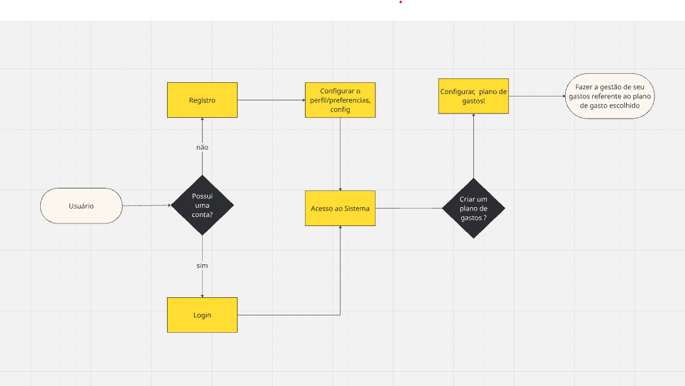

# 💰 Invoicely

**Invoicely** é um aplicativo mobile voltado para **finanças pessoais**, criado para ajudar os usuários a **gerenciar seus gastos** de maneira prática, personalizada e eficiente.

A proposta é permitir a criação de **planos de gastos personalizados**, oferecendo controle total sobre as finanças, promovendo organização, economia e maior estabilidade financeira.

---

## 📱 Tecnologias Utilizadas

- **React Native** (mobile)
- **TypeScript** (segurança e manutenção do código)
- **Prisma ORM** (camada de persistência de dados)
- **SQLite** (banco de dados local)
- **JWT + Bcrypt** (autenticação segura)

---

## 🚀 Funcionalidades Iniciais

O que o usuário poderá fazer na primeira versão:

- ✅ Criar uma conta no sistema (cadastro/login)
- ✅ Configurar seu perfil financeiro
- ✅ Criar um **plano de custos personalizado**
- ✅ Incluir e categorizar despesas
- ✅ Visualizar um resumo dos gastos por período

---

## 📊 Fluxo de Uso

Abaixo, um exemplo visual simplificado do fluxo inicial de uso do aplicativo:

---

## ✔️ O que será testado

| Código   | Funcionalidade                                                                 |
|----------|---------------------------------------------------------------------------------|
| RF01     | O usuário deve ser capaz de criar uma conta                                    |
| RF02     | O usuário deve ser capaz de fazer login                                        |
| RF04     | Criar um ou mais planos de gastos com nome, descrição e período                |
| RF05     | Criar categorias personalizadas de despesas dentro dos planos                  |
| RF07     | Cadastrar despesas associadas a um plano de gastos                             |

---

## ❌ O que não será feito

As demais funcionalidades descritas nos requisitos serão implementadas e testadas em versões futuras.

---

## ✅ Critérios de Sucesso

- Cada funcionalidade testada deve funcionar corretamente conforme sua descrição.
- Operações básicas de **CRUD (Create, Read, Update, Delete)** devem estar funcionando para os elementos principais: usuários, planos, categorias e despesas.
- Os dados devem ser armazenados e exibidos corretamente com base na interação do usuário.

---

## 📋 Requisitos Funcionais

- **RF01** – Criar conta com e-mail e senha  
- **RF02** – Login com credenciais válidas  
- **RF03** – Editar perfil do usuário (nome, foto, moeda, etc.)  
- **RF04** – Criar planos de gastos com nome, descrição e período  
- **RF05** – Criar categorias customizadas por plano  
- **RF06** – Editar ou excluir planos existentes  
- **RF07** – Cadastrar despesas dentro de um plano  
- **RF08** – Informar valor, categoria, data e descrição ao registrar despesas  
- **RF09** – Editar e excluir despesas  
- **RF10** – Calcular e exibir o total gasto por plano e categoria  
- **RF11** – Mostrar resumo financeiro por plano (saldo restante, total gasto)  
- **RF12** – Exibir gráficos simples por categoria  
- **RF13** – Exibir histórico de gastos por período

---

## ⚙️ Requisitos Não Funcionais

- **RNF01** – Interface intuitiva e responsiva  
- **RNF02** – Telas devem carregar em até 2 segundos  
- **RNF03** – Armazenamento seguro de credenciais (JWT + bcrypt)  
- **RNF04** – Suporte a Android 8.0+ e iOS 13+  
- **RNF05** – Estrutura backend escalável com Prisma  
- **RNF06** – Suporte a sincronização e backup dos dados com servidor

---

## 5. 🧰 Recursos Necessários

### Equipamentos:

| Equipamento        | Especificações mínimas             |
|--------------------|------------------------------------|
| Celular Android    | Versão 10 ou superior              |
| Computador         | Expo|

---

## 6. 🛠️ Plano de Execução

### Etapas de Execução:

1. Preparação dos ambientes de teste
2. Instalação da versão de teste do sistema
3. Execução dos casos de teste manuais
4. Registro de defeitos encontrados
5. Análise de resultados

### Ambiente de Teste:

| Ambiente        | Descrição                                    |
|-----------------|----------------------------------------------|
| Desenvolvimento | Versão interna com novas funcionalidades     |
| Homologação     | Ambiente próximo ao de produção              |

---

---

## 8. ⚠️ Riscos e Mitigações

| Risco Identificado               | Possível Impacto                            | Estratégia de Mitigação                    |
|----------------------------------|---------------------------------------------|--------------------------------------------|
| Incompatibilidade com iOS antigo | App não funciona em certos dispositivos     | Testes em diferentes versões do sistema     |
| Falta de dispositivos reais      | Atraso nos testes manuais                   | Utilização de emuladores e simuladores     |
| Erros de sincronização           | Dados inconsistentes entre sessões          | Implementar validações e logs de fallback  |

---

## 9. 🧪 Tipos de Testes Utilizados

- [x] Testes Funcionais    

### Método de Execução:

- [ ] Manual  
- [x] Automatizado  
- [ ] Híbrido  

---

